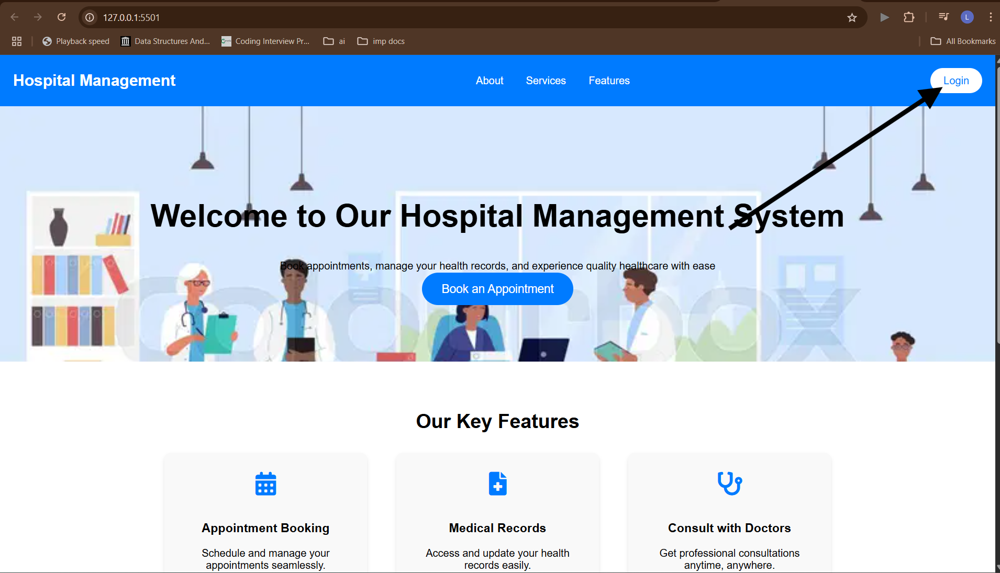
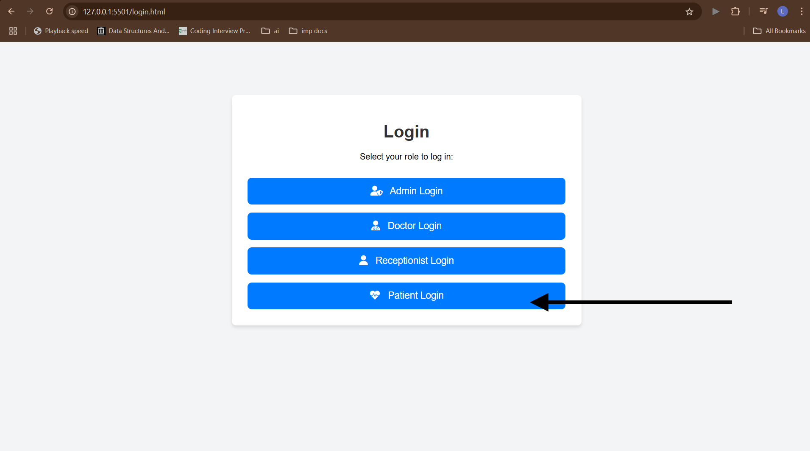
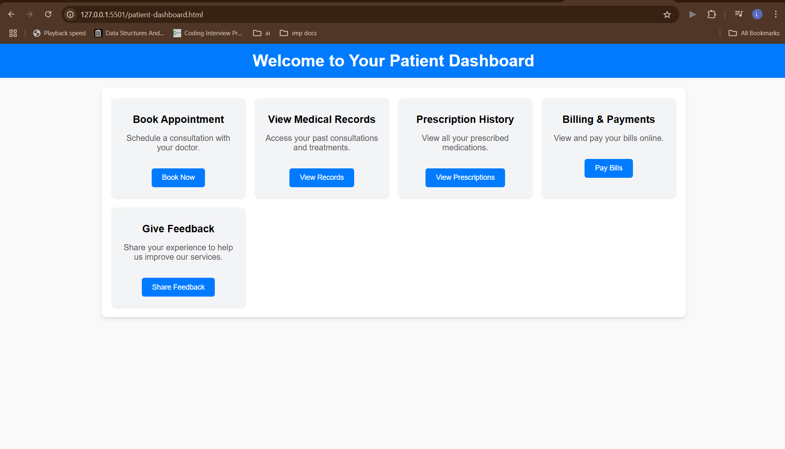
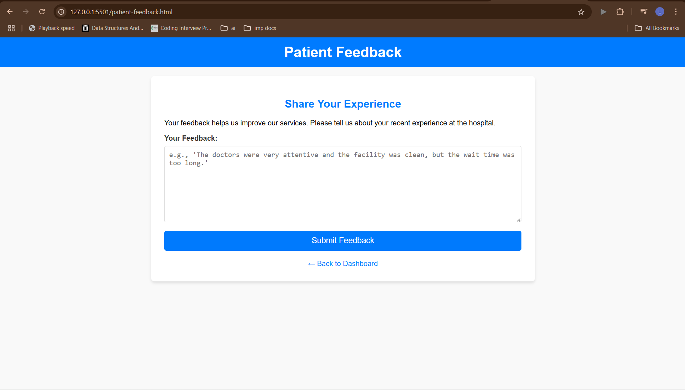
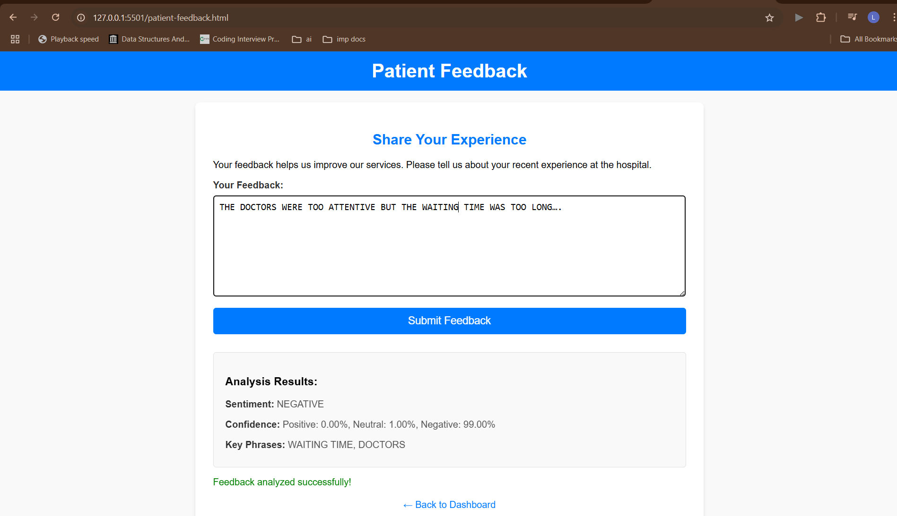

# Hospital Management System (HMS) with AI-Powered Patient Feedback Analysis

## Project Overview

This project implements a basic Hospital Management System (HMS) with a focus on integrating AI capabilities for patient feedback analysis. The system allows patients to submit feedback, which is then processed by an Azure AI Language Service to determine sentiment and extract key phrases.

**Key Features:**
* Patient-facing frontend for submitting feedback.
* Backend API (Flask) to handle feedback submission and interact with Azure AI.
* Sentiment analysis of patient feedback (Positive, Negative, Neutral, Mixed).
* Extraction of key phrases from feedback.

## Technologies Used

* **Frontend:** HTML, CSS, JavaScript (Vanilla JS for API calls)
* **Backend:** Python 3, Flask
* **AI Service:** Azure AI Language (Text Analytics)
* **Package Management:** `pip`
* **Version Control:** Git, GitHub

## Prerequisites

Before you can run this project locally, you need to have the following installed and set up on your machine:

* **Git:** [Download & Install Git](https://git-scm.com/downloads)
* **Python 3.8+:** [Download & Install Python](https://www.python.org/downloads/) (Ensure you add Python to your PATH during installation).
* **An Azure Account:** You will need an active Azure subscription to create and use the Azure AI Language service. If you don't have one, you can sign up for a [free Azure account](https://azure.microsoft.com/free/).

## Azure AI Language Service Setup

This project uses Azure AI Language for its sentiment analysis and key phrase extraction. You need to create your own Language Service resource in Azure and obtain its credentials.

1.  **Log in to the Azure Portal:** Go to [portal.azure.com](https://portal.azure.com/).
2.  **Create a Language Service:**
    * Search for "Language Service" in the top search bar.
    * Select "Language Service" from the results and click "Create".
    * Fill in the required details:
        * **Subscription:** Choose your Azure subscription.
        * **Resource Group:** Create a new one or choose an existing one (e.g., `hms-feedback-rg`).
        * **Region:** Choose a region close to you or your users.
        * **Name:** Give it a unique name (e.g., `my-hms-language-service`).
        * **Pricing tier:** Select a suitable tier (e.g., `F0 - Free` for testing purposes).
    * Click "Review + create" and then "Create".
3.  **Obtain Endpoint and Key:**
    * Once your Language Service resource is deployed, navigate to it in the Azure Portal.
    * In the left-hand navigation, under "Resource Management," click on **"Keys and Endpoint"**.
    * Copy your **Key 1** (or Key 2) and the **Endpoint URL**. You will need these for the next step.

## Local Setup and Running the Project

Follow these steps to get the project running on your local machine:

1.  **Clone the Repository:**
    Open your terminal or command prompt and execute the following commands:
    ```bash
    git clone [https://github.com/YourGitHubUsername/YourRepositoryName.git](https://github.com/YourGitHubUsername/YourRepositoryName.git)
    cd YourRepositoryName
    ```
    (Replace `YourGitHubUsername` and `YourRepositoryName` with your actual GitHub username and repository name.)

2.  **Navigate to the Backend Directory:**
    ```bash
    cd hms_backend
    ```

3.  **Create and Activate a Python Virtual Environment:**
    It's highly recommended to use a virtual environment to manage dependencies.
    ```bash
    python -m venv venv
    # On Windows:
    .\venv\Scripts\activate
    # On macOS/Linux:
    source venv/bin/activate
    ```
    You should see `(venv)` at the beginning of your terminal prompt, indicating the environment is active.

4.  **Install Python Dependencies:**
    Install all the required Python libraries using `pip`:
    ```bash
    pip install Flask azure-ai-textanalytics==5.3.0 python-dotenv Flask-CORS
    # OR, if you've created a requirements.txt file:
    # pip install -r requirements.txt
    ```

5.  **Configure Azure Credentials (`.env` file):**
    This is a critical step for security. You must create a `.env` file with *your own* Azure AI Language Service credentials.
    * Create a new file named `.env` directly inside the `hms_backend` directory (the same directory where `app.py` is located).
    * Add the following lines to the `.env` file, replacing the placeholder values with the **Key 1** and **Endpoint** you obtained from the Azure Portal:
        ```
        AZURE_LANGUAGE_KEY="YOUR_AZURE_LANGUAGE_KEY"
        AZURE_LANGUAGE_ENDPOINT="YOUR_AZURE_LANGUAGE_ENDPOINT"
        ```
    * **Important:** This `.env` file is intentionally ignored by Git (via `.gitignore`) and will **not** be uploaded to GitHub for security reasons.

6.  **Run the Flask Backend Server:**
    While still in the `hms_backend` directory and with your virtual environment activated, run the Flask application:
    ```bash
    python app.py
    ```
    Keep this terminal window open. You should see output indicating that the server is running on `http://127.0.0.1:5000`.

7.  **Access the Frontend and Test AI Feature:**
    Follow these steps to experience the AI-powered feedback analysis:

    * Open your web browser and navigate to the root of your project (e.g., by double-clicking `index.html` or `patient-dashboard.html` in your file explorer).
    * **Login to the System:** Click on the 'Login' button in the top right corner of the homepage.
        
    * **Select Patient Login:** On the login role selection page, click on 'Patient Login'.
        
    * **Navigate to Feedback:** From the Patient Dashboard, locate the "Give Feedback" card and click the 'Share Feedback' button.
        
    * **Enter Your Feedback:** You will be directed to the Patient Feedback page. Type your feedback into the designated text area.
        
    * **Submit and View Analysis:** Click the "Submit Feedback" button. The "Analysis Results" section will appear below, displaying the sentiment (Positive, Negative, Neutral, Mixed), confidence scores, and key phrases identified by Azure AI Language.
        **_Remember to capture a screenshot of this part after submitting feedback and save it as `images/analysis_results.png`!_**
        

## Project Structure